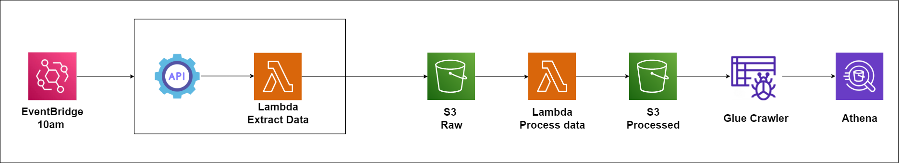

# AWS Data Processing Pipeline

This project is an AWS-based data processing pipeline designed to extract, process, and analyze data in batch. The pipeline uses several AWS services, including Lambda, Glue and Athena.

## Pipeline Architecture


1. **EventBridge**: Triggers the process daily at 10 AM UTC+1 (cron schedule).
2. **Lambda (Extract Data)**: Extracts data from an external source.
3. **S3**: Stores raw and processed data.
4. **Lambda (Process Data)**: Processes the raw data and stores it.
5. **Glue Crawler**: Analyzes the processed data and updates the data catalog.
6. **Athena**: Allows querying the processed data.

## AWS Services Used

- **EventBridge**: For task scheduling.
- **Lambda**: For data extraction and processing.
- **S3**: For storing raw and processed data.
- **Glue**: For data discovery and cataloging.
- **Athena**: For data analysis.

## APIs Used

### Batch API: JSONPlaceholder
JSONPlaceholder is a fake REST API used to simulate batch data in this project. It provides simple endpoints to fetch test data such as users, posts, and comments. This API is used to extract data via a lambda function and process it in the AWS pipeline.

**Link**: [JSONPlaceholder](https://jsonplaceholder.typicode.com)

## Project Structure

- **.github/workflows**: The workflow script that runs the test functions on every push or pull.
- **terraform/**: Folder containing Terraform configuration files.
- **terraform/modules**: The modules used to create the AWS infrastructure, each module represents an AWS service.

## Lambda Deployment Notes

The Terraform configuration for Lambda functions includes additional steps to install dependencies, copy files, create ZIP archives, and upload them to an S3 bucket before deployment. These steps are automated using `null_resource` and `archive_file` resources.

### Important Notes:
- **The provided Terraform commands must be executed in PowerShell**.
- If you are not using Windows, modify the `copy_command` variable in `terraform/modules/lambda/variables.tf` to suit your operating system.

## Installation Requirements

### 1. Install Terraform
Ensure that Terraform is installed on your local machine. Follow the official documentation for installation:
[Terraform Installation Guide](https://learn.hashicorp.com/tutorials/terraform/install-cli)

### 2. Install Python
Ensure Python is installed on your local machine. If not, download and install it from the official Python website:
[Python Download](https://www.python.org/downloads/)

Verify the installation by running:
```bash
python --version
```

If using multiple versions, ensure you are using Python 3:
```bash
python3 --version
```

### 3. Clone the Repository
Clone this repository to your local machine:
```bash
git clone <repository_url>
cd <repository_folder>
```

### 4. Configure AWS CLI
Ensure your AWS CLI is configured with the appropriate access credentials.
If you haven't configured it yet, you can do so by running:
```bash
aws configure
```

### 5. Initialize Terraform
Navigate to the Terraform folder and initialize the working directory.
```bash
cd terraform
terraform init
```

### 6. Create a Terraform Variables File
Create a `terraform.tfvars` file and define the variable `ARN_User` with the ARN of your AWS user:
```hcl
ARN_User = "arn:aws:iam::123456789012:user/your-user-name"
```

### 7. Create a Terraform Plan
Run the following command to create an execution plan:
```bash
terraform plan
```

### 8. Apply the Plan
Apply the Terraform plan to create the resources on AWS.
```bash
terraform apply
```

### 9. Monitor the Process
Once the pipeline is deployed, monitor the logs and data flow. Use the AWS Console for insights into the following:
- Lambda function logs
- Glue crawler job status
- Athena query results

### 10. Cleanup
To remove the resources, you can use the following Terraform command:
```bash
terraform destroy
```

## Testing the Lambdas

Each Lambda function has its own test file. You can run them manually as follows:

### 1. Navigate to the Lambda folder
```bash
cd Lambda
```

### 2. Install dependencies
Run the following command to install required Python packages:
```bash
pip install boto3
pip install requests
pip install pytest mock
```

### 3. Run the test
Run the test using unittest:
```bash
cd ./Lambda/StoreJsonPlaceholderUsers
export PYTHONPATH="." 
python -m unittest discover
```

Repeat the same steps for the other Lambda function `ProcessJsonPlaceholderUsers`.

## License

This project is licensed under the Apache License 2.0 - see the [LICENSE](LICENSE) file for details.

